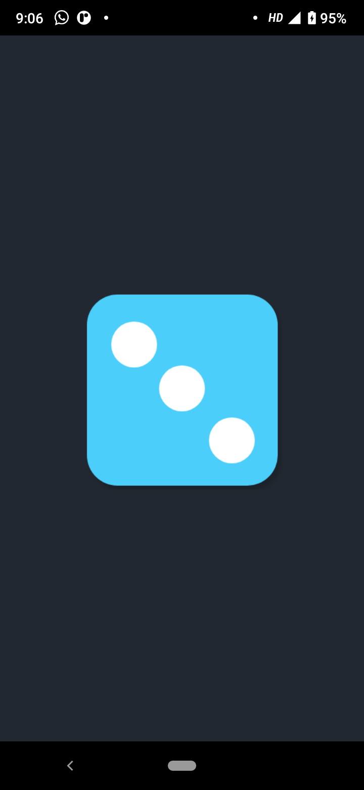
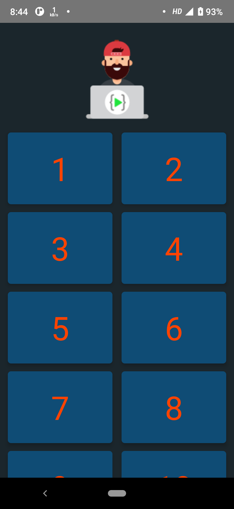

# react-native-course
### Course by LCO
[Course Link](https://courses.learncodeonline.in/learn/home/Complete-React-Native-Mobile-App-developer)

**1. BgChanger**

 

  

 

  

 

**2. DiceRoller**

 

  

 

  

 

**3. Spanish Number**

 

  

 

  

 